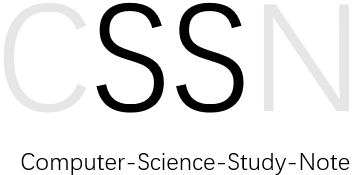

<center>



</center>

## 计算机科学学习笔记

工作多年之后才意识到大学本科阶段学习的那些基础课程的重要性。于是，笔者决定利用自己工作之余的时间，再重新学习一下大学本科阶段学习的基础课程。当然，数学、政治及英语类的课程除外，即本学习内容只包含了和计算机有关的课程内容。

当然，本文档也可以作为java程序员面试时需要恶补的知识点合集。除此之外，本仓库也可以作为非CS专业的计算机课程资料。


## 概述

本仓库是以课程为单位的文件夹构成。每门课程都附带了一些教学资源，这些资源包括视频材料（文档中有连接）、文档材料（在每门课程的文件夹内）以及笔者的笔记。

每个文件夹中都有以下内容：

- readme.md ：用来写本门课程的主要概况以及学习资料等。
- image ：用来存放本门课程中重要的图片。
- material ： 用来存放本门课程中的学习资料等。

```
..
│  overview.md
│  readme.md
│
├─image
│      01-01.png
│      01-02.png
│
└─material
        算法图解.pdf
```


## 课程列表

### 计算机网络

- [x] [chapter01 概述](docs/computer-network/chapter01-overview.md)
- [x] [chapter02 物理层](docs/computer-network/chapter02-physical-layer.md)
- [x] [chapter03 数据链路层](docs/computer-network/chapter03-data-link-layer.md)
- [ ] [chapter04 网络层](docs/computer-network/chapter04-network-layer.md)
- [ ] [chapter05 运输层](docs/computer-network/chapter05-transport-layer.md)
- [ ] [chapter06 应用层](docs/computer-network/chapter06-application-layer.md)
- [ ] [chapter07 网络安全](docs/computer-network/chapter07-network-security.md)
- [ ] [chapter08 互联网上的音频/视频服务](docs/computer-network/chapter08-vedio.md)
- [ ] [chapter09 无线网络和移动网络](docs/computer-network/chapter09-wifi-wireless.md)

### test
- [x] [数据结构与算法基础-java版](docs/algorithm/overview.md)
- [x] [mysql高级](docs/mysql/00.readme.md)
- [ ] [设计模式]()
- [ ] [nginx]


## 其他项目

<div align="center" style="border: solid red 1px;"><br />
  <a href="https://github.com/zeanzai/Java-Linux" target="_blank">java-linux</a><br />

    

  Java程序员的必备Linux运维技能，包括各种服务器软件的安装和运维等基本运维参考文档。

  <a href="https://zeanzai.me/Java-Linux/" target="_blank">快捷访问入口</a>
</div>
<br />
<div align="center" style="border: solid red 1px;"><br />
  <a href="https://github.com/zeanzai/java-interview-questions" target="_blank">java-interview-questions</a><br />

    

  😃 本仓库是笔者在2019年跳槽找工作时收集的面试问题，内容丰富、涉及面广，面向初级、中高级几乎所有阶段的java程序员，希望能帮助大家快速准备java面试。

  <a href="https://zeanzai.me/java-interview-questions/" target="_blank">快捷访问入口</a>
</div>

## 说明

本文档基于[docsify](https://docsify.js.org/#/zh-cn/)创建，部署在GitHub Page上面。

## License

<a rel="license" href="http://creativecommons.org/licenses/by-nc-sa/4.0/"></a>
