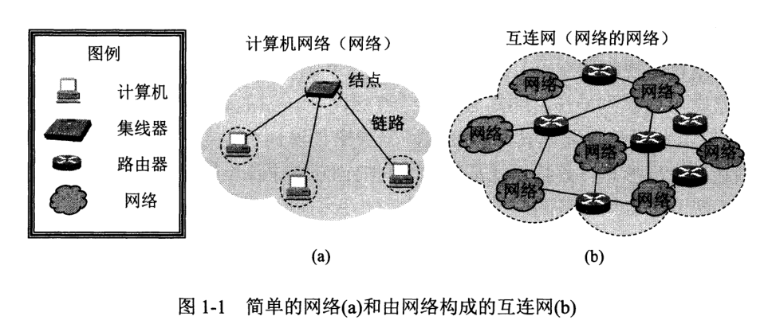
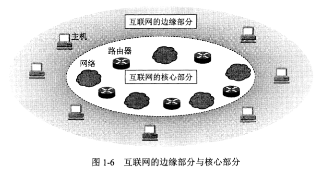
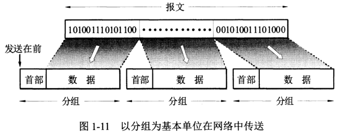
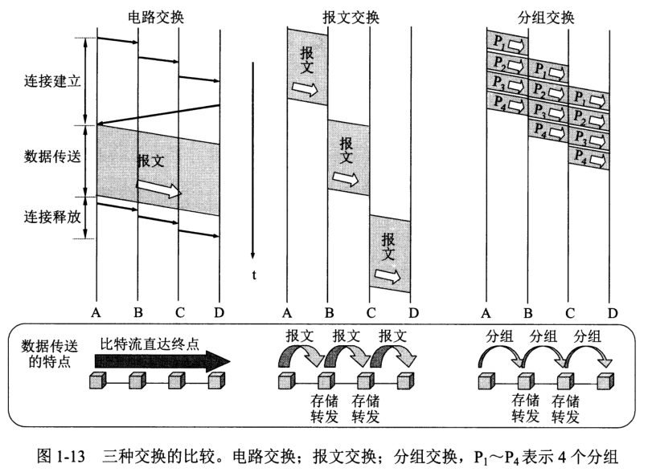
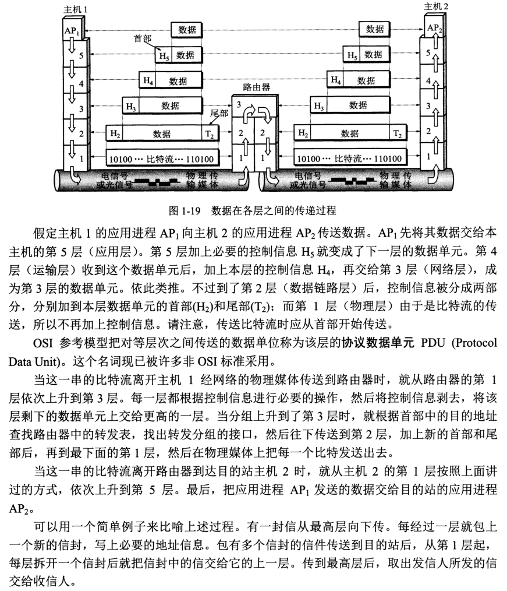
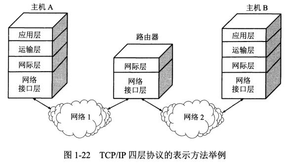
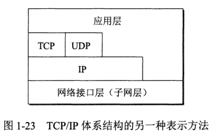
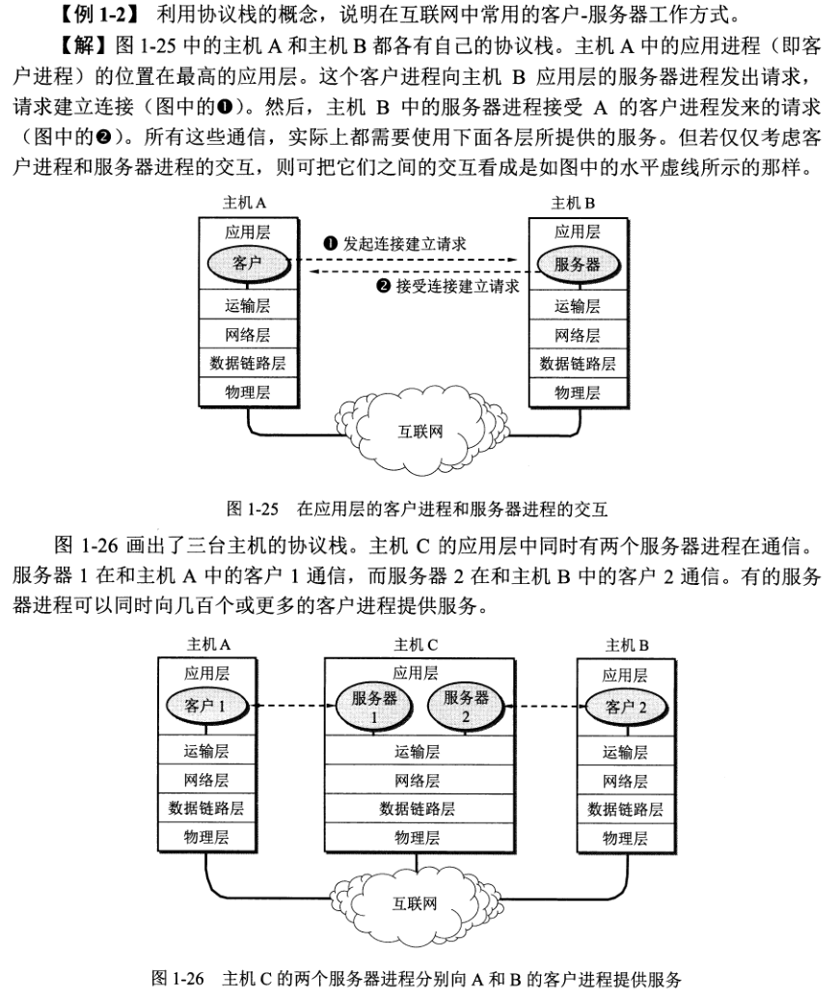

 本章重点内容：

（1） 互联网边缘部分和核心部分的作用，其中包含分组交换的概念

（2） 计算机的性能指标

（3） 计算机网络的分层次的体系结构，包含协议和服务的概念

## 1.1 计算机网络的作用

- 三网： 电信网络、有线电视网、计算机网络
- 作用： 连通性、共享

## 1.2 因特网概述
- 网络是由若干结点（node，包括计算机、集线器、交换机或路由器等）和连接这些结点的链路（link）组成。

- 因特网发展的三个阶段：
  - 从单个网络向互联网发展的过程

  - 建成了三级结构的因特网

  - 逐渐形成了多层次ISP（Internet Service Provider，因特网服务提供者）结构的因特网

    因特网服务商从因特网管理机构申请多个IP地址，通过通信线路为用户提供上网服务。

    为了使不同层次的ISP经营的网络都能互通，1994年创建了四个网络接入点NAP（network access point，每个接入点之间是对等关系）

    一旦某个用户接入因特网，那么他就成为了一个ISP，他只需要购买一些调制解调器或路由器就可以使其他用户相互连通

    了解NGI计划
- 因特网的标准化工作：
  - 成立国际组织，设置两个不同职能的部门
  - 制定标准的流程：
    因特网草案(internet draft) -> 建议标准(proposed standard)->草案标准(draft standard)->因特网标准(internet standard)

## 1.3 因特网的组成

- 边缘部分
  由所有连接到因特网上的主机组成，用户直接使用，提供通信和资源共享。
  主机A和主机B进行通信：实际上指的是：运行在主机A上面的某个进程和运行在主机B上面的某一进程进行通信，即计算机之间的通信。
  边缘部分的进程之间的通信分为两大类：
    - 客户-服务器方式
      服务请求方即为客户端，服务提供方即为服务器端。
    - 对等连接（peer-to-peer，P2P）
      互为对方的服务器端，也互为对方的客户端。
- 核心部分
  由大量网络和连接这些网络的路由器组成，为边缘部分提供服务，提供连通性和交换。
  此部分起特殊作用的是路由器，而路由器的主要任务是：分组转发（packet switching）。
    - 电路交换
      主要关键词就是：独占资源

    - 分组交换
      **报文**：需要发送的整块数据叫做报文

      **分组**：将报文分为等长的数据段，然后加上必要的控制信息组成的**首部**就构成了分组，也称为**包**，首部成为**包头**

      路由器就是用来转发分组的。路由器收到一个分组后，先进行暂存，然后检查其首部，查找转发表，按照首部中的目的地址，找到合适的接口转发出去，把分组交给下一个路由器。

      **优点**： 高效（动态分配带宽，逐段占用链路）、灵活（为每一个分组独立选择转发路由）、迅速（以分组为单位传送，可以不先建立连接传输）、可靠（使用可靠的网络协议、分布式多路由的分组交换网）

    - 报文交换
      现将整个报文传递到相邻结点，全部存储下来之后再查找转发表，转发给下一个结点。

## 1.4 计算机网络在我国的发展
略

## 1.5 计算机网络的类别
- 计算机网络的定义：一些互相连接的、自治的计算机的集合。
- 按照不同作用范围划分
  - 广域网（wide area network）
  - 城域网（metropolitan area network, MAN）
  - 局域网（local area network, LAN）
  - 个人区域网（personal area network, PAN）
- 按照不同使用者划分
  - 公用网（public network）
  - 专用网（private network）
- 用来把用户接入因特网的网络
  接入网AN（access network），既不属于核心部分，也不属于边缘部分

## 1.6 计算机网络的性能
- 性能指标
  - 速率

    单位时间内传输的数据量的大小，单位： b/s  kb/s  mb/s等
  - 带宽

    **信号带宽**：某种信号所包含的各种不同频率成分所占的频率范围
    **网络带宽**：表示单位时间内从网络中的某一个点到另一个点所能通过的**最高数据率**
  - 吞吐量

    单位时间内通过某个网络（或信道、接口）的数据量，更多的运用于对现实世界中的网络的一种测量，以便知道到底有多少数据量能够通过网络
  - 时延

    **发送时延**，也叫传输时延，主机或路由器发送数据帧所需要的时间，也就是从发送数据帧的第一个比特算起，到该帧的最后一个比特发送完毕为止所需要的时间。计算公式为：发送时延=数据帧长度/信道带宽

    **传播时延**，电磁波在信道中传播一段距离所需要的时间。计算公式为：传播时延=信道长度/传播速率

    **处理时延**，主机或路由器在收到分组时需要花费一定时间进行处理数据，例如分析首部、提取数据部分、进行差错检验、查找路由

    排队时延，分组经过网络传输时，在输入队列中的排队等待时间

    **究竟哪一种时延占主导地位，需要具体情况具体分析。对于高速网络链路，我们提高的仅仅是数据的发送速率而不是比特在链路上的传输速率，也就是只是减少了发送时延。**

  - 时延带宽积

    把链路比作圆柱形管道，管道的长度（以时间为单位表示链路长度）比作链路的传播时延，管道的截面积代表链路的带宽，而管道的体积就代表时延带宽积。例如：某段链路传播时延：20ms，带宽：10Mb/s，则时延带宽积为：`20*10^-3*10*10^6=2*10^5bit`。也就是说，如果发送端持续发送数据，则在发送第一个比特即将到达终点时，发送端发送了`2*10^5`个bit，而这`2*10^5`个bit正在链路上面向前移动。因此又被称为：以比特为单位的链路长度。
  - 往返时间（RTT，round-trip time）

    从发送方发送数据开始到发送方收到接收方的确认时所需要的时间。多用于衡量卫星通信
  - 利用率

    **信道利用率**，某信道有多少比例的时间是被利用的。

    **网络利用率**，全网络的信道率的加权平均值。

    根据排队理论，当某个信道利用率增大时，该信道上面引起的时延也迅速增加。可以类比高速公路。这要求我们懂得：信道或网络利用率过高，就会产生非常大的时延。
- 非性能指标
  - 费用
  - 质量
  - 标准化
  - 可靠性
  - 可扩展性和可升级性
  - 易于管理和维护

## 1.7 计算机网络体系结构

- 开放系统互联基本参考模型（OSI/RM）的由来历史及废弃原因

- 事实上的国际标准：TCP/IP

- 网络协议（network protocol）

  - 定义

  > 为进行网络中的数据交换而建立的规则、标准或约定称为网络协议

  - 三要素

  > 语法：数据与控制信息的结构或格式
  >
  > 语义：需要发出的控制信息、完成的动作以及做出的响应
  >
  > 同步：事件实现顺序的详细说明

- 协议分为两种不同表现形式

  一种：便于人们来阅读和理解的文字描述

  一种：能让计算机理解的程序代码

- 复杂的计算机网络应该是分层的，分层的优点有：

  - 各层相互独立
  - 灵活性好
  - 结构上可分割
  - 易于实现和维护
  - 能够促进标准化工作

- 每一层都需要完成以下一些（可以是一种，也可以是多种）

  - 差错控制： 使相应层次对等方的通信更加可靠
  - 流量控制：发送端的发送速率必须使接收端来得及接收，不能太快
  - 分段和重装：发送端将发送的数据划分为更小单位，在接收端还原
  - 复用和分用：发送端高层会话复用低层连接，接收端进行分用
  - 建立连接和释放连接：交换数据前建立一条逻辑连接，数据传送结束后释放连接

- 体系结构和实现

  体系结构是指计算机网络的各层及其协议的集合，换言之，计算机网络的体系结构就是这个计算机网络及其构建所应完成的功能的精确定义。这些功能究竟是用何种硬件或软件来完成，则是一种遵循这种体系结构的实现。总之，体系结构是抽象的，实现是具体的。

- **具有五层协议的体系结构**

  - 应用层

    任务：完成应用进程之间的交互

    协议定义：应用进程之间的**通信和交互**规则，如：DNS、HTTP、SMTP等

    数据单元：报文

  - 运输层

    任务：应用进程间的**数据传输**、分用和复用服务

    协议

     - 传输控制协议TCP（transmission control protocol），提供面向连接的、可靠的数据传输服务，数据单元为：报文段（segment）
     - 用户数据报协议UDP（user datagram protocol），提供无连接的、尽最大努力的数据传输服务，数据单元为：用户数据报

  - 网络层

    任务：为不同主机提供通信服务、将运输层产生的报文段或用户数据报分装成**分组（也叫IP数据报，二者等同）**或**包**进行传送

    协议： IP协议

    数据单元：IP数据报，也称分组或数据报

    网络层也称网际层或IP层

  - 数据链路层

    任务：在发送端将网络层交下来的IP数据报封装成帧，在接收端将帧提取称IP数据报

    数据单元：帧（frame）

    每一帧都包括数据和必要的控制信息（同步信息、地址信息、差错控制等）

  - 物理层

    任务： 将数据转化为0和1的比特流

    数据单元： 比特（bite）

    通常人们说TCP/IP时，是指互联网所使用到的整个**TCP/IP协议族（protocol）**

  传输的复杂过程好像被屏蔽了，就如同两个相同层次之间直接通信一样，这就是所谓的对等层之间的通信。同理，各层协议，就是各个对等层之间传递数据的协议。协议栈，是因为几个层次画在一起像一个栈一样的结构。

- 实体、协议、服务和服务访问点

  - 实体：表示任何可发送或接收信息的硬件或软件进程
  - 协议：控制两个对等实体（或多个实体）进行通信的规则的集合。在协议的控制下，两个对等实体间的通信使得本层能够向上一层提供服务，也能够为下一层提供服务
  - 服务：协议是水平的，服务是垂直的，即服务是由下层向上层通过层间接口提供。不在同一层内完成的功能都称为服务。上层使用下层提供的服务是通过与下层交换命令完成的，这些命令在OSI中被称为**服务原语**。层与层之间的交换数据单元称为：服务数据单元SDU（service data unit），与PDU（协议数据单元，对等层之间的数据格式）
  - 服务访问点：SAP（service access point），相邻两层的实体进行交互（交换信息）的地方

  协议需要把所有的不利条件事先都估计好，不能假定一切都是正常的和非常理想的。检查协议是否正确，不能只看正常情况下能否使用，还必须要检查协议是否能够应付各种异常情况。

- TCP/IP的体系结构
TCP/IP体系结构比较简单，只有四层，路由器在转发分组时最高只用到网络层而没有用到运输层和应用层。如下图：

技术的发展并不是严格遵循OSI分层概念，实际上已经演变成如下图所示的体系结构：

TCP/IP协议可以为各式各样的应用提供服务，也允许IP协议在各式各样的网络构成的互联网上运行。如下图，可以看出IP协议在互联网中的核心作用。

利用例子来说明协议栈在互联网常用的客户-服务器工作方式中的位置：

