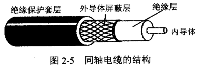
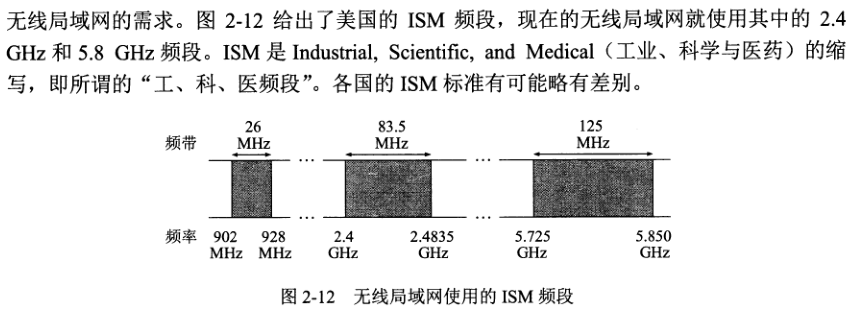
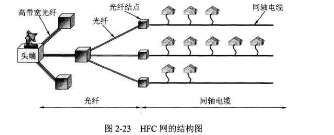
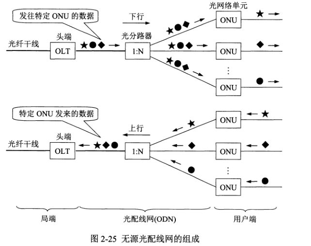

本章重点内容：

（1）物理层的任务

（2）几种常用的信道复用技术

（3）几种常用的快带接入技术，主要是ADSL和FTTx

## 2.1 物理层的基本概念
**物理层考虑的是如何在连接各种计算机的传输媒体上传输数据比特流的问题，而非具体的传输媒体，当然，也不能忽略传输媒体在此层的重要作用。物理层的作用就是尽可能的屏蔽掉传输媒体和通信手段的差异，使物理层上的数据链路层感觉不到差异，这样数据链路层就只需要考虑如何完成本层的协议和服务，而不必考虑网络具体的阐述媒体和通信手段是什么。**
要了解物理层的主要任务，就必须明确一个目标：物理层的主要任务是确定与传输媒体的接口有关的一些特性。

这些特性有：

（1）机械特性

指明接口所用的接线器的形状和尺寸、引脚数目和排列、固定和锁定装置等。平时常见的各种规格的接口插件都有严格的标准化的规定。

（2）电气特性

电压范围

（3）功能特性

电压表示含义

（4）过程特性

不同功能的各种可能事件的出现顺序

## 2.2 数据通信的基础知识

- 一个数据系统可以划分为三个部分：源系统（或称发送端、发送方）、传输系统（或称传输网络）和目的系统（或称接收端、接收方）。

- 常用术语：

  - 通信的目的是**消息**（message）
  - 运输消息的实体是**数据**（data）
  - 数据的电磁或电气表现是**信号**（signal）

- 信号分类：

  - 模拟信号（连续信号）：代表消息的参数的取值是连续的
  - 数字信号（离散信号）：代表消息的参数的取值是离散的（即0状态和1状态，0和1即为码元：代表着不同离散数值的基本波形）

- 信道

  - 定义：用来表示向某一方向传递消息的媒体（可以理解为信号的通道，逻辑意义上的概念——笔者注）。一条通信电路上往往包含一条发送信道和一条接收信道。

  - 通信双方信息的交互方式有以下三种：

    - 单向通信（单工通信）：只有一个方向上的通信而没有反方向的交互。例如：无线电广播、电视广播等。
    - 双向交替通信（半双工通信）：通信的双方都可以发送信息，但是不能双方同时发送（也不能同时接收）。
    - 双向同时通信（全双工通信）：通信双方可以同时发送也可以同时接收信息。

  - 信号处理方式：

    - 为什么要处理信号？

      来自源的信号被称为**基带信号**（即基本频带信号），由于基带信号中包含了很多低频成分，甚至会有直流成分，而许多信道的电气或电磁特性又不允许传输这些低频分量或直流分量。因此就必须对信号进行处理，对信号进行处理的手段统称为**调制**（modulation）。

    - 调制的分类

      - 基带调制：对基带信号的波形进行变换，使之能适应信道的电磁或电气特性。
      - 带通调制：将基带信号的频率范围搬移到较高的频段以便在信道中传输，这种方式成为带通调制，调制过的信号称为**带通信号**（即仅能够在一段频率范围内通过信道）。
        - 带通调制方法的分类：
          - 调幅（AM），即载波的振幅随基带数字信号而变化
          - 调频（FM），即载波的频率随基带数字信号而变化
          - 调相（PM），即载波的初始相位随基带数字信号而变化
          - 正交振幅调制（QAM），复杂的多元制的振幅相位混合调制方法

  - 传输速率

    影响码元在信道上的传输速率的因素

    - 信道能够通过的频率范围
    - 信噪比

## 2.3 物理层下面的传输媒体

- 传输媒体也成为传输介质或传输媒介，它是数据传输系统中在发送器和接收器之间的物理通路。

- 传输媒体分类：

研究传输媒体时，需要通过不同的角度去分析：定义、传输型号类型、传输速率、传输距离、额外设备、使用场所、基本原理、经济成本等

  - 导向传输媒体：电磁波主要沿着固体媒体传播
    - 双绞线：
      - 把两根相互绝缘的铜导线并排放到一起，然后使用规则的方法绞合起来就构成了双绞线（可减少相邻导线的电磁干扰）；
      - 到处都有的电话系统就是以双绞线为传输介质的；
      - 可以传输模拟信号，也可以传输数字信号；
      - 传输距离可达几公里，传输速率每秒几兆比特；
      - 长距离传输需要中继器（对数字信号进行整形）和放大器（对模拟信号进行放大）
      - 根据是否在双绞线的外面加上一层金属丝编织的屏蔽层，把双绞线分为屏蔽双绞线（STP，shielded twisted pair）和无屏蔽双绞线（UTP，unshielded twisted pair）
      - 绞合度（单位长度内的绞合次数）越高，双绞线的质量越好
      - 
    - 同轴电缆

      - 抗干扰特性好，传输较高速率数据
      - 主要用在有线电视网的居民小区中
      - 结构如下图
    

    - 光缆

      - 利用光导纤维（光纤）传递光脉冲来进行通信（0-无光脉冲，1-有光脉冲）
      - 传输带宽大，约为10^8MHz量级
      - 发送端通过发光二极管或半导体激光器将电脉冲转化成光脉冲
      - 接收端利用光电二极管将光脉冲还原为电脉冲
      - 利用全反射的原理将光沿着光纤传输下去
      - 光纤传输数公里基本没有什么衰耗
      - 由多条不同角度入射的光线在一条光纤中传输的光纤称为多模光纤。只适合近距离传输。
      - 具有传输损耗小、中继距离长、抗雷电和电磁干扰特性好、无串音干扰、保密性好、体积小、重量轻、
      - T形接头（有源和无源）
    - 架空明线：已经被废弃

  - 非导向传输媒体：电磁波沿着自由空间传输，也称为无线传播

    无线传输使用的频段很广

    - 短波通信
      - 主要靠电离层的反射，但是会产生多径效应（由于电离层的不稳定性造成的）
      - 低速传输，速率为几十至几百比特每秒，采用复杂的调制解调技术后，才能提升到几千比特每秒
    - 微波通信
      - 频率范围：300MHz到300GHz（波长1m到1mm），主要使用2~40GHz的范围
      - 直线传输，传输距离很远
      - 应用在：地面微波接力通信和卫星通信
      - 天线塔，中继站
      - 传输：电话、电报、图像、数据
      - 特点：
        - 频率高，通信信道的容量大
        - 传输质量高
        - 经济成本低、不受地理位置限制
        - 天线塔必须能够直视
        - 受恶劣天气影响
        - 隐蔽性和保密性较差
        - 人力成本物力成本较大
      - 同步卫星通信
        - 使用微波通信。因为微波通信距离远，通信费用与通信距离**无关**。
        - 同步地球通信卫星可以看做是无人值守的微波通信的中继站
        - 具有较大的传播时延
        - 覆盖面广
        - 保密性较差
        - 造价高
      - 地轨道卫星通信
        - 轻便的手持通信设备都可以使用卫星通信。
    - 红外通信，近距离传输
    - 激光通信，近距离传输

## 2.4 信道复用技术

复用是通信技术中的基本概念。

- 分类

  - 频分复用（FDM，frequency division multiplexing）

    用户分配到一定频带后，在通信过程中，自始至终都只使用这个频带。即所有用户在同样的时间内占用不同的带宽（频带带宽，非传输带宽）资源。

    例如：假设一个信道上面能够传输的频率带宽为2GHz-40GHz，频分复用的概念是，将频率带宽按照用户个数划分为等范围的带宽，然后给每个用户都分配一个频带，而每一个用户在通信过程中，自始至终都使用分配给它的带宽资源。

  - 时分复用（TDM，time division multiplexing）

    将要传输的帧划分为一段段等时间长的时分帧（称为时分复用帧，TDM帧），每一个用户在每个TDM帧中占用固定序号的时隙。即所有用户在不同时间占用同样的频带宽度。更有利于数字信号的传输。

    例如：将要传输的信号根据时间等长切分，然后给每个用户分配切分后的等长时间（称为时隙，一个用户占用一个时隙，用户有多少个，时隙就划分多少个），复用器会周期性地扫描每个用户，然后复用器扫描一个周期后，将扫描后的数据组合成TDM帧发送，达到时分复用的效果。

    但由于时分复用中的计算机并不是一直在发送数据，所以，在一个TDM帧内，可能有些用户没有发送数据，这就造成了线路资源的浪费。

  - 统计时分复用（STDM，statistic TDM）

    统计时分复用是对时分复用的一种改进。其时隙数小于连接集中器上的用户数。基本原理跟时分复用基本一样，只不过是统计时分复用中的用户所占用的时隙并不是周期性地出现。

  - 波分复用（WDM，wavelength division multiplexing）

    波分复用就是光的频分复用。

  - 码分复用（CDM，code division multiplexing）

    有点复杂

## 2.5 数字传输系统

早期的数字传输系统中存在着很多缺点，最主要的有以下两种：

- 速率标准不统一
- 不是同步传输

## 2.6 宽带接入技术

2015年1月，美国联邦通信委员会FCC对接入网的“宽带”进行了重新定义，规定下行速率为25Mbit/s，上行速率为3Mbit/s。

从带宽接入的媒体来看，可以划分为两大类。一类是有线宽带接入，另一类是无线宽带接入。本章节只讲述有线宽带接入技术。

- 非对称数字用户线（ADSL，asymmetric digital subscriber line）技术

  非对称数字用户线技术是使用数字技术对现有的模拟电话用户线进行改造。

  对频带进行划分，不同的频带范围给不同的功能使用，如0至4000Hz的低端频谱留给传统电话使用，没有被利用的高端频谱留给用户上网使用，由于ADSL的下行带宽远远大于上行带宽，非对称的名称就是根据这个原因得来的。

  ADSL的传输距离取决于数据率、用户的线径（用户线越细，信号传输的衰减就越大）。

  ADSL所能得到的最高数据传输速率还与实际的用户线上的信噪比有关。

  **（需要补充ADSL的布线模型）**

  第二代ADSL改进的地方：

  - 提高了调制效率得到了更高的数据率
  - 采用了无缝速率自适应技术SRA
  - 改善了线路质量评测和故障定位功能

  **（需要补充xDSL，龙国柱博士制定的标准）**

- 光纤同轴混合网（HFC网）

  - 定义

  光纤同轴混合网（HFC，Hybrid fiber coax）是目前覆盖面很广的有线电视网的基础上开发的一种居民宽带接入网，可传送电视节目、提供电话、数据和其他宽带交互型业务。

  - 模型

  HFC网把原有线电视网中的同轴电缆主干部分换成光纤，光纤从头端连接到光纤结点。在光纤结点处光信号转化为电信号，然后通过同轴电缆传输到用户家中。
  

  - 特点

    连接一个光纤结点的典型用户为500，不超过2000

    光纤结点到头端的典型距离为25km，光纤结点到用户的距离不超过2到3km

    具有双向传输功能

  - 频带划分

    

  - 设备

    机顶盒：连接到同轴电缆和用户电视机之间的，将数字信号转化为模拟信号的装备。

    电缆调制解调器（cable modem）：只需要安装在用户端，完成解决共享信道可能出现冲突问题等复杂问题的设备。

  - 其他

    使用ADSL调制解调器时，用户计算机所连接的电话用户线是该用户专享的，也就是说ADSL用户线上所能达到的最高数据率是确定的，与其他ADSL是否在上网无关。

    HFC的电缆调制解调器，在同轴电缆这一段用户所享用的最高数据率是不确定的。因此某个用户所能达到的最高数据率是不确定的，取决于这段电缆上现在有多少个用户正在传输数据。若出现大量的用户，那么每个用户实际的上网速率可能会低到难以忍受的程度。

- FTTx技术

  - 定义

    FTTx（fiber to the x），是指ISP把光纤一直铺设到x（C，curb，光纤到路边FTTC；Z，zone，光纤到小区FTTZ；B，building，光纤到大楼FTTB；F，floor，光纤到楼层FTTF；O，office，光纤到办公室FTTO；D，desk，光纤到桌面）。

  - 模型

    主干线使用光纤传输。

    光纤干线和广大用户之间则使用一段中间转换装置（光配线网ODN，optical distribution network），使得数十个家庭用户能够共享一根光纤干线。常用的是无源光网络PON（passive optical network）。

    

    无源光网络PON种类很多，当下最流行的有两种：

    - 以太网无源光网络（EPON， Ethernet PON），在链路层使用以太网协议，利用PON拓扑结构实现以太网接入，具有兼容性好、成本低、扩展性好、管理方便的有点。
    - 吉比特无源光网络（GPON，Gigabit PON），采用通用封装方法GEM（generic encapsulation method），可承载多业务，对各种业务类型都能够提供服务质量保证，是很有潜力的宽带光纤接入技术。

  - 设备

    - OLT（optical line terminal）：光线路终端，连接到光纤干线的终端设备。主要作用是
      - 把收到的下行数据发往无源的1：N光分路器（splitter）；
      - 接受由1：N光分路器（splitter）发来的数据；
    - 1：N光分路器（splitter）：下行数据时使用广播的形式传递数据给ONU，上行数据时将ONU传过来的数据进行汇总，并使用TDMA（时分多址）方式发往OLT，典型的是1:32
    - ONU（optical network unit）：光网络单元。具有特有的标识，只接受发送给自己的数据。负责在上行数据时将电信号转化为光信号，下行数据时将光信号转化为电信号。
