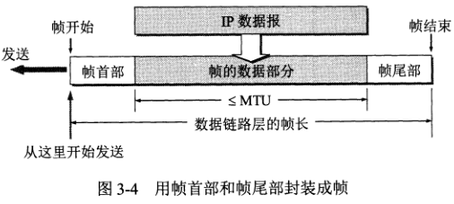
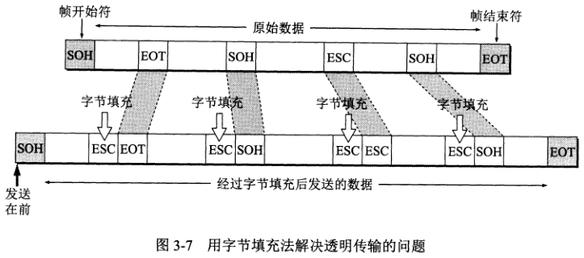
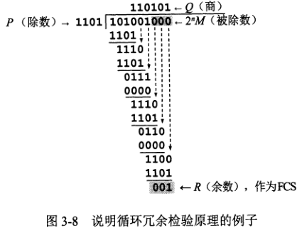
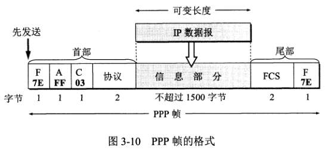
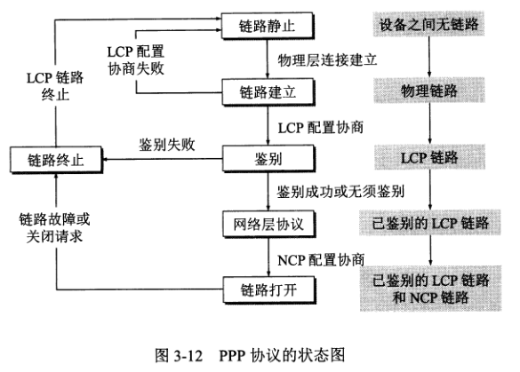

本章重点内容：

本章讨论的是同一个局域网中，分组怎么从一个主机传送到另一台主机，并不经过路由器转发。

（1）数据链路层的点对点信道和广播信道的特点，及这两种信道所使用的协议的特点

（2）数据链路层的三个基本问题：封装成帧、透明传输和差错检测

（3）以太网MAC层的硬件地址

（4）适配器、转发器、集线器、网桥、以太网交换机的作用及使用场合

只讨论数据的水平流动。

## 3.1 使用点对点信道的数据链路层

- 概念

  - 链路

    一个结点到相邻结点的一段物理线路（有线或无线），中间没有任何其他交换结点，链路只是一条路径的组成部分。也称物理链路（对应逻辑链路）。

  - 数据链路

    在一条线路上传输数据时，除了必须要有一条物理线路外，还必须要有一些必要的通信协议来控制数据的传输，把实现这些协议的硬件和软件加到链路上，就构成了数据链路。也称为逻辑线路（对应物理链路，就是物理链路加上必要的通信协议）。

  - IP数据报（数据报、分组、包）

    网络层协议数据单元。

  - 帧

    数据链路层的协议数据单元，包裹了IP数据报

  - 最大传输单元MTU（maximum transfer unit）

    链路层协议规定了所能传输的帧的数据部分长度上限就是**最大传输数据单元**

    

  - 帧界定符

    可以用来标识帧的边界的特殊编码。

  - 透明传输

    在数据链路层透明传输数据表示无论什么样的比特组合的数据，都能够按照原样没有差错的通过该数据链路层。

- 数据链路层通信的主要步骤

  1. 结点A的数据链路层把网络层交下来的IP数据报进行添加首部和尾部封装成帧的操作；
  2. 结点A把封装好的帧发送给结点B的数据链路层；
  3. 结点B的数据链路层校验收到的帧是否有差错，若没有差错，就从收到的帧中去除IP数据报交给上层网络层，否则就丢弃这个帧。

- 传输过程中可能遇到的问题及目标

  1. 帧传输时出现的问题（即大块比特进行传输时）： 帧丢失、帧重复和帧失序，需要实现的目标是：可靠传输，数据链路层不考虑这部分问题
  2. 帧转化为比特进行传输时：比特丢失、比特错位（0变1，1变0），需要实现的目标是：无比特差错，数据链路层主要解决这部分问题

- 三个基本问题

  数据链路层协议有很多，但是都需要讨论三个基本问题，这三个基本问题是共同的：封装成帧、透明传输、差错检测。

  - 封装成帧

    - 做法

      使用包含许多必要的控制信息组成的首部（ASCII码中的SOH——start of header，十六进制编码：01，二进制编码：0000 0001）和尾部（ASCII码中的EOT——end of transmission，十六进制编码：04，二进制编码：0000 0100）将由网络层传来的IP数据报进行包裹，组成帧。

      

  - 透明传输

    - 做法

      发送端的数据链路层在数据中如果出现控制字符，就在控制字符前面插入转义字符“ESC”（十六进制编码1B）

      

  - 差错检测

    - 做法

      采用算法对传输到发送端的数据链路层的帧进行差错检测，但不做纠正，只进行检测，帧有问题只进行丢弃，不做其他处理。常用的检测方法有循环冗余检验CRC（cyclic redundancy check）。

    - CRC算法过程：

      1. 发送端数据链路层与接收方数据链路层事先商定好一个除数P（有n+1位）；
      2. 发送端数据链路层对要发送的帧的比特流进行扩大2的n次方倍，即在比特流后加n个0；
      3. 使用扩大后的比特流（被除数）进行除法运算（P为除数），得到余数R1（有n位）；
      4. 将余数拼接到原来的比特流后面一同发送给接收端；
      5. 接收端将接收到的比特流进行CRC运算，得到余数R2
      6. 判断R2是否等于0，如果等于0，就判定该帧没有出错，就执行接受操作；如果R2不等于0，就执行丢弃操作

      

    - 模2运算

  - 应用

    由于过去的OSI观点是，必须让数据链路层向上提供可靠传输，所以在CRC基础上，增加了帧编号、确认和重传机制。但是由于通信线路的质量大大提高，现在的互联网就采取了区别对待的方法：

    对通信质量较好的有线传输链路，数据链路层协议不使用确认和重传机制，即不要求向上提供可靠服务，差错纠正由上层协议来完成。

    对通信质量较差的无线传输链路，数据链路层协议要求使用确认和重传机制，即要求提供可靠服务。

## 3.2 点对点协议PPP

在通信线路质量较差的年代，在数据链路层使用可靠传输协议曾经是一种好办法，因此，能实现可靠传输的高级数据链路控制HDLC（High-level data link control）就成为了当时比较流行的数据链路层协议。

但对于点对点的链路，简单的多的点对点协议PPP（point-to-point protocol）则称为应用最为广泛的数据链路层协议。

- 实现PPP协议的原则

  - 功能简单
  - 可以封装成帧
  - 透明传输
  - 支持多种网络层协议
  - 支持多种类型链路
  - 支持差错检测
  - 能够检测连接状态
  - 具有最大传输单元
  - 网络层地址可以协商
  - 协商数据压缩算法

- PPP协议组成部分

  - 一个将IP数据报封装成串行链路的方法
  - 一个用来建立、配置和测试数据链路连接的链路控制协议LCP
  - 一套网络控制协议NCP

- PPP协议的帧的格式

  - 各字段的意义

    

    注意：FAC等字母都是代表字段名称，7E等都是十六进制数值。

  - 透明传输的做法

    - 字节码填充

      进行转义：将0x7E填充为0x7D+0x5E；将0x7D填充为0x7D+0x5E；数值小于0x20的字符前面加0x7D，并改变该字符的编码（如出现0x03——控制字符中的“传输结束ETX”的值，就把它变成0x7D+0x23）

    - 零比特填充

      出现5个连续的1时，就填充一个0

- PPP协议的工作状态

  

## 3.3 使用广播信道的数据链路层
