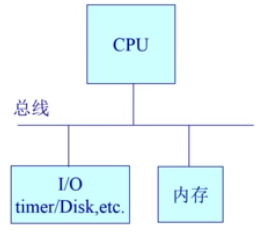

# 启动、中断、异常和系统调用

## 启动
达到

disk：存放OS文件
BIOS：基本IO处理系统
bootloader：用来加载OS

定义
- 调用
  - 应用程序请求操作系统提供服务
  - 异步或同步时间点处理
  - 等待和持续的响应过程
- 异常
  - 来源于应用程序意想不到的行为
  - 同步时间点处理
  - 响应：杀死或重新执行
- 中断
  - 来源于外设
  - 异步时间点处理
  - 响应：持续，对应用程序透明

为什么应用程序不能直接访问硬件？
- 内核是稳定的第三方
- 提供硬件访问的同一接口
- 具备安全性

## 中断、异常和系统调用

P10

dddd
